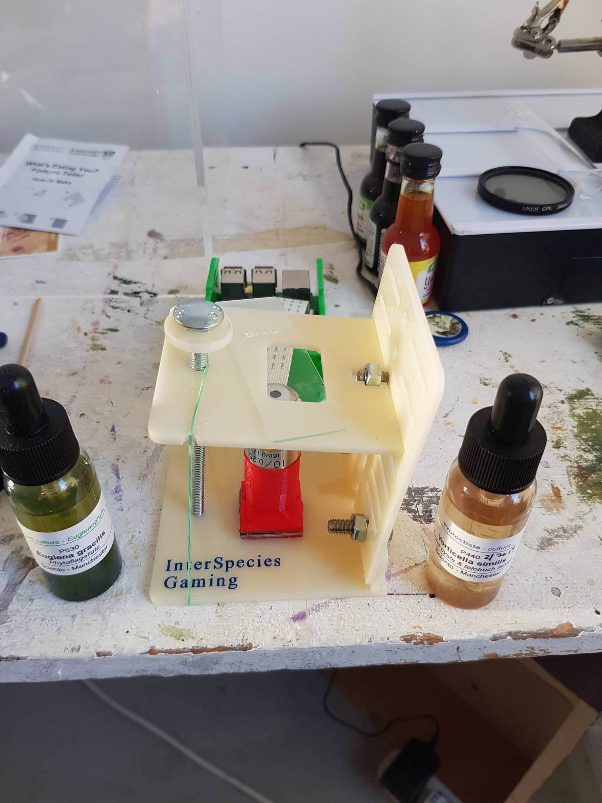
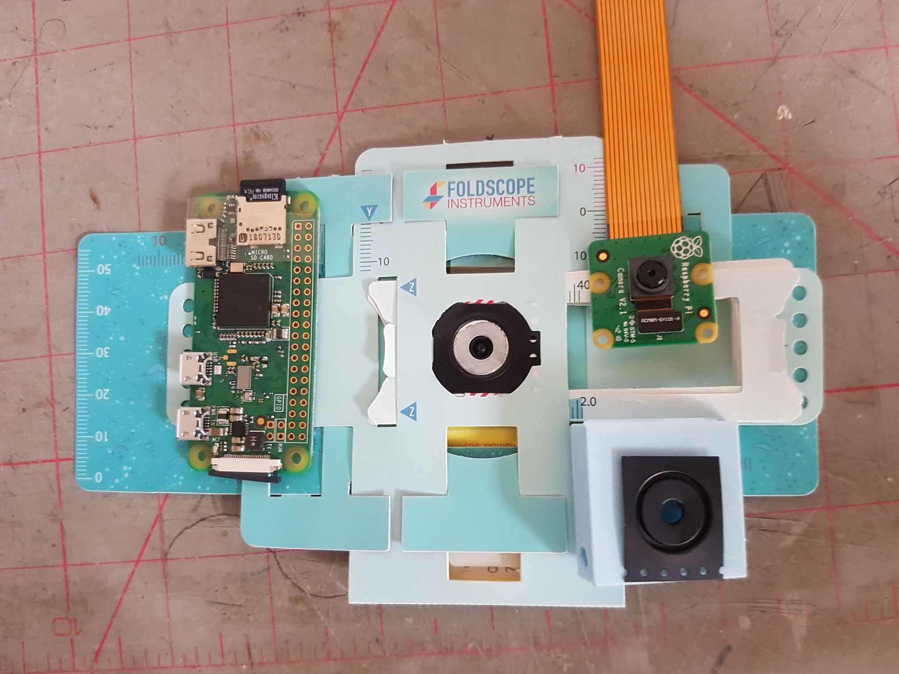
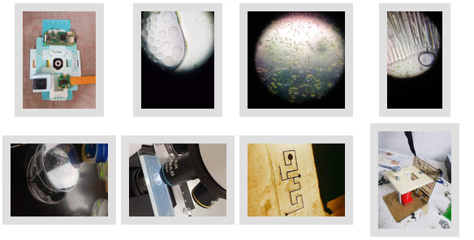
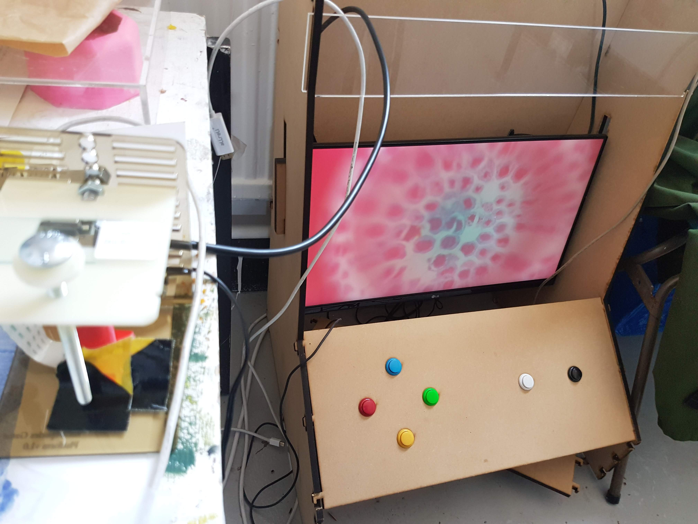

# Ethical Microscope

DIY Hackteria remix of the [OpenFlexure Microscope](https://github.com/rwb27/openflexure_microscope) used for a clubbiomed Twitch stream and review-by-making of popular DIY microscopes. The RPi camera to twitch function uses [MakeSpaceLive](https://github.com/DynamicDevices/makespacelive) which Alex Lennon and Matt at [DoES Liverpool](http://doesliverpool.com) kindly made to help watch making live and share across a federation of maker spaces.

I also modified a piZero camera with a 3D printed case included here so you can connect to a [Foldscope](https://www.foldscope.com)

### Ethics

Why ethical? In the first instance it is open source and freely available and is meant to help people access basic microscopy.

However our main aim is to develop a microfluidic aquarium to add-on to the stage so that microorganisms don't have to dehydrate and die on the slide which is common practice only to provoke thinking about how we work with and learn from microorganisms when we observe them and what that might mean in terms of ethics and waste.

The micro aquarium is still a work in progress.

### Images

### Build Guides

The build files here are based on Hackteria [Tutorial Here](https://publiclab.org/notes/partsandcrafts/02-15-2018/2-attaching-your-raspberry-pi-camera-to-a-microscope-objective-lens)
 from their [Quick Build Tutorial](https://publiclab.org/notes/partsandcrafts/12-02-2017/quick-build-raspberry-pi-microscope)

You can find original parts Ive modified here [Hackteria Microscope Stage](https://www.thingiverse.com/thing:1057872)

Here's the deluxe OpenFlexure microscope [Docmentation Here](http://rwb27.github.io/openflexure_microscope/docs/0_printing.html)
