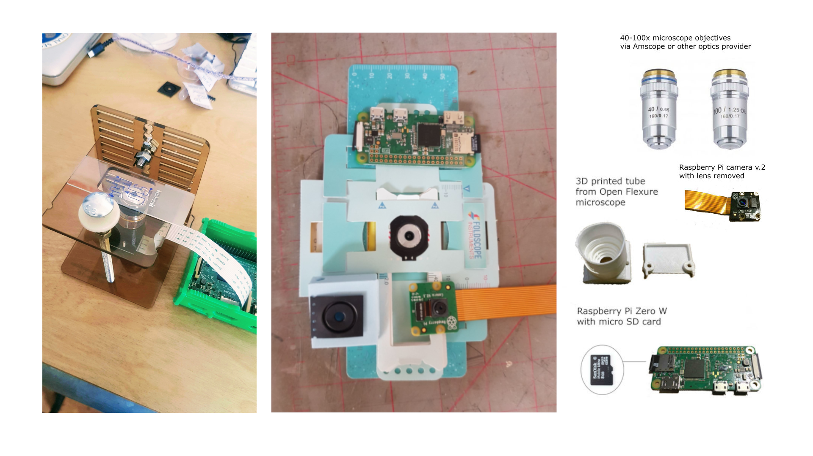
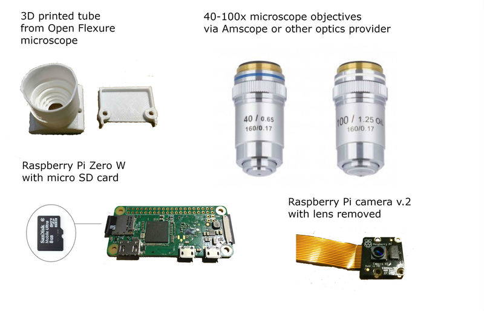

# Ethical Microscope

DIY remix of [Public Labs version of the Simple Hackteria microscope](https://publiclab.org/notes/partsandcrafts/11-26-2017/building-a-raspberry-pi-microscope) following the [Public Lab Build Guide](https://publiclab.org/notes/partsandcrafts/11-26-2017/building-a-raspberry-pi-microscope) while looking lovingly at the [OpenFlexure Microscope project](https://github.com/rwb27/openflexure_microscope). Makes a pop-up microscopic Twitch stream using a Raspberry Pi and camera and  [MakeSpaceLive](https://github.com/DynamicDevices/makespacelive) RPi software by Alex Lennon and Matt Croughan at [DoES Liverpool](http://doesliverpool.com) to share live video and 3Dprinter progress across a federation of makerspaces.

Also includes a piZero camera with 3D printed case compatible with a [Foldscope](https://www.foldscope.com)

### Ethics

Why ethical? It’s open source and freely available and is meant to help people, especially makers, access basic microscopy using lasercut acrylic, standard microscope optics available on eBay and 3D printed PLA. Numerous open source designs for microscopy exist but here a barebones, minimum effort and low cost approach brings together the Hackteria and Publiclab designs and makes it compatible with a foldscope and affordable for classroom use.

It was also designed as part of a microfluidic aquarium add-on to the stage so that microorganisms don't have to dehydrate and die on the slide. This is a prompt to provoke thinking about how we work with and learn from microorganisms when we observe them, and what that might mean in terms of ethics and waste.

## MET Matrix

[MET Matrix](MET_Matrix.md)

Map out the energy toxicity matrix so we trace the complete carbon cost of your build using the [Materials Energy Toxicity Matrix](http://thingscon2018.productscience.net/) developed at OMGCLIMATE 2019. We found this via [@mrchrisadams](https://twitter.com/mrchrisadams) excellent talk on [Reducing Carbon In the Digital Realm](https://docs.google.com/presentation/d/1_uTPiW5aMCwFhZcpLDxjY-AQMgDmHIyUEZQQ-G6XXq8/edit#slide=id.g5d9e2f62d2_0_42) at [Maintenance Festival 2019 in Liverpool](https://festivalofmaintenance.org.uk)

### Images

### Build Guides

The build files here are based on Hackteria [Tutorial Here](https://publiclab.org/notes/partsandcrafts/02-15-2018/2-attaching-your-raspberry-pi-camera-to-a-microscope-objective-lens)
 from their [Quick Build Tutorial](https://publiclab.org/notes/partsandcrafts/12-02-2017/quick-build-raspberry-pi-microscope)

You can find original parts Ive modified here [Hackteria Microscope Stage](https://www.thingiverse.com/thing:1057872)

Here's the deluxe OpenFlexure microscope [Docmentation Here](http://rwb27.github.io/openflexure_microscope/docs/0_printing.html)
